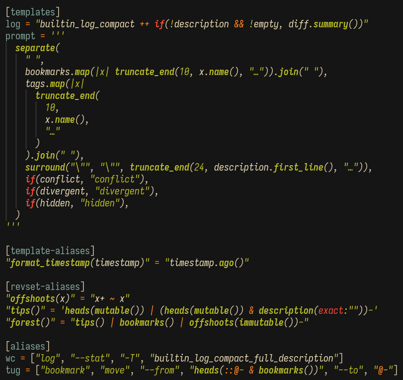

# nvim-treesitter-jjconfig

This is a neovim plugin providing filetype detection and a treesitter parser for revset
expressions and templates inside [jj](https://jj-vcs.github.io) configuration files.

It gives you syntax highlighting and autoindentation for:

- toml strings containing jj revset expressions:
    - in `[revsets]/[revset-aliases]` tables
    - in command aliases when immediately following "--revisions", "--from", "--to",
      etc. (I've left out the short forms for now because they seem likely to trigger
      false positives.)
- toml strings containing jj templates:
    - in `[templates]/[template-aliases]` tables
    - in command aliases when immediately following "--template" or "-T".



For now it applies only when the first line of a file is exactly the following:

```toml
"$schema" = "https://jj-vcs.github.io/jj/latest/config-schema.json"
```

## Dependencies

- [nvim-treesitter](https://github.com/nvim-treesitter/nvim-treesitter)

## Installation

Install this neovim plugin in whatever manner you prefer, and somewhere in your setup
_after_ setting up `nvim-treesitter`, call
`require("nvim-treesitter-jjconfig").config()`. You can optionally provide an options
table with any of the following options:

| Option           | Type | Effect        |
| ---------------- | ---- |----------------------------------------------------------- |
| ensure_installed | bool | automatically install the jj treesitter parsers at startup |
| sync_install     | bool | do the automatic installation synchronously                |

Example [lazy.nvim](https://lazy.folke.io/) config:

```lua
return {
    {
        "nvim-treesitter/nvim-treesitter",
        lazy = false,
        build = ":TSUpdate",
        config = function()
            require("nvim-treesitter.configs").setup({
                -- ...
            })
        end
    },
    {
        "acarapetis/nvim-treesitter-jjconfig",
        dependencies = { "nvim-treesitter/nvim-treesitter" },
        lazy = false,
        opts = { ensure_installed = true },
    }
}
```

## Thanks

This would not be possible without the
[jjtemplate](https://github.com/bryceberger/tree-sitter-jjtemplate) and
[jjrevset](https://github.com/bryceberger/tree-sitter-jjrevset) parsers by bryceberger.

The syntax highlighting queries for jjtemplate and jjrevset included in this repo
were [originally written by bryceberger for
helix](https://github.com/helix-editor/helix/pull/13926/files).

Thanks to bryceberger and algmyr for a fruitful conversation on the JJ discord.
