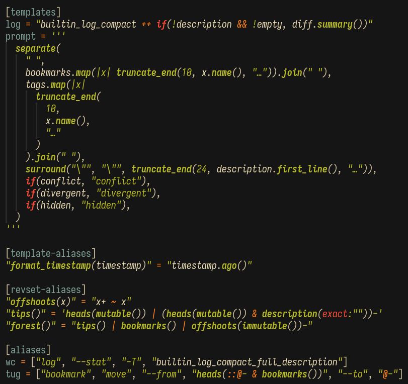

# nvim-treesitter-jjconfig

**NOTE**: This version of nvim-treesitter-jjconfig is compatible only with the new
`main` branch of nvim-treesitter. If you're still using the `master` branch of
`nvim-treesitter` you can use our corresponding version
[here](https://github.com/acarapetis/nvim-treesitter-jjconfig/tree/master), but note
that it will not receive any future features.

This is a neovim plugin providing filetype detection and a treesitter parser for revset
expressions and templates inside [jj](https://jj-vcs.github.io) and
[jjui](https://github.com/idursun/jjui) configuration files.

## jj config features

The `jjconfig` parser provides syntax highlighting and autoindentation for:

- toml strings containing jj revset expressions (via the injected `jjrevset` parser):
    - in `[revsets]/[revset-aliases]` tables
    - in command aliases when immediately following "--revisions", "--from", "--to",
      etc. (I've left out the short forms for now because they seem likely to trigger
      false positives.)
- toml strings containing jj templates (via the injected `jjtemplate` parser):
    - in `[templates]/[template-aliases]` tables
    - in command aliases when immediately following "--template" or "-T".
- toml strings containing shell scripts:
    - in command aliases when immediately following the sequence "sh", "-c" or "bash",
      "-c".



These features should be activated whenever you're editing a toml file that declares its
schema to be jj's config-schema, either with a top-level JSON Schema declaration:

```toml
"$schema" = "https://jj-vcs.github.io/jj/latest/config-schema.json"
```
or with a Taplo/Tombi schema directive comment:

```toml
#:schema https://docs.jj-vcs.dev/latest/config-schema.json
```

Note that this schema directive comment must be part of a comment block at the very top
of the file.

## jjui config features

The `jjui` parser provides syntax highlighting and autoindentation for:

- lua scripts in jjui custom commands

This is activated whenever you're editing a file called `config.toml` in a directory
called `jjui`.

## Dependencies

- [nvim-treesitter](https://github.com/nvim-treesitter/nvim-treesitter) (`main` branch)

## Installation

Install this neovim plugin in whatever manner you prefer, and somewhere in your setup
call `require("nvim-treesitter-jjconfig").setup()`. This registers the parsers
`jjconfig`, `jjrevset`, `jjtemplate` and `jjui` with nvim-treesitter, so they are then
available to install via `:TSInstall` or `require("nvim-treesitter").install`.

Example [lazy.nvim](https://lazy.folke.io/) config below. Note the dependency order - we
want nvim-treesitter-jjconfig to be loaded first so that nvim-treesitter"s build step
includes our parsers.

```lua
return {
    {
        "nvim-treesitter/nvim-treesitter",
        branch = "main",
        lazy = false,
        build = ":TSUpdate",
        dependencies = {
            "acarapetis/nvim-treesitter-jjconfig",
            branch = "main",
            opts = {},
        },
        config = function()
            local ts = require("nvim-treesitter")
            ts.install({ "jjconfig", "jjrevset", "jjtemplate", "jjui" })
            vim.api.nvim_create_autocmd("FileType", {
                pattern = "*",
                callback = function(ev)
                    pcall(vim.treesitter.start, ev.buf)
                    vim.bo[ev.buf].indentexpr = "v:lua.require'nvim-treesitter'.indentexpr()"
                end
            })
        end,
    }
}
```

## Thanks

This would not be possible without the
[jjtemplate](https://github.com/bryceberger/tree-sitter-jjtemplate) and
[jjrevset](https://github.com/bryceberger/tree-sitter-jjrevset) parsers by bryceberger.

The syntax highlighting queries for jjtemplate and jjrevset included in this repo
were [originally written by bryceberger for
helix](https://github.com/helix-editor/helix/pull/13926/files).

Thanks to bryceberger and algmyr for a fruitful conversation on the JJ discord.
